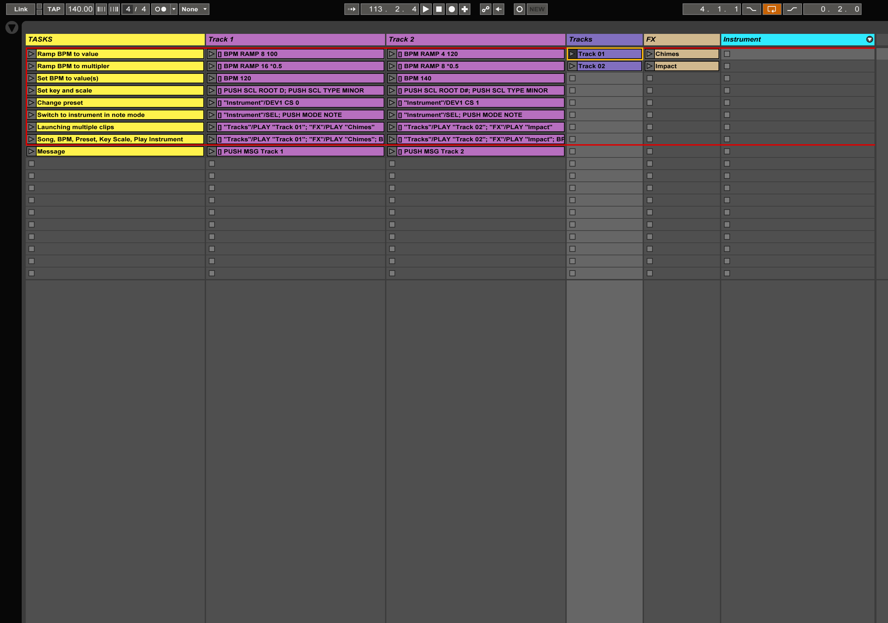
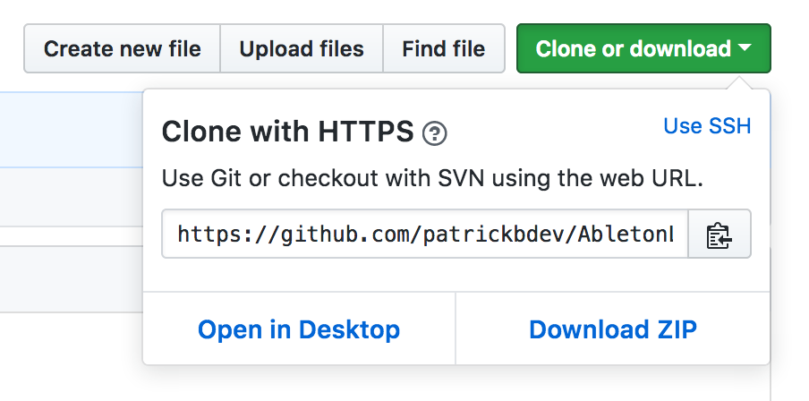

# Ableton Live ClyphX Examples

ClyphX commands covered:

* Ramp BPM to value
* Ramp BPM to multipler
* Set BPM to value(s)
* Set key and scale
* Change preset
* Switch to instrument in note mode
* Launching multiple clips
* Song, BPM, Preset, Key Scale, Play Instrument
* Message

## Contained Resources
* Manual
* Presentation
* Ableton Live Project

## How to Use
1. First download ClyphX from [here](http://beatwise.proboards.com/thread/992/current-version-clyphx-live-9)
2. Follow the installation instructions in the manual
3. Open the project

## How to Download These Files
Click *Clone or download* in the top right.

